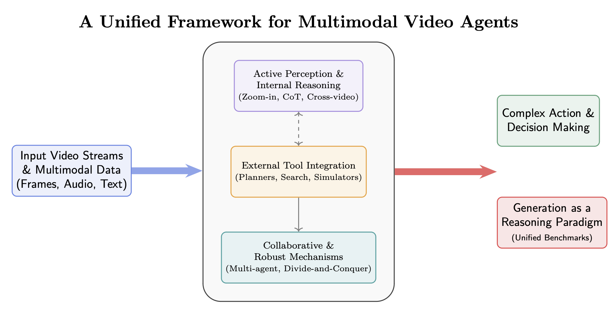

# Awesome-Video-Agent (Think-with-Videos)

This repository collects research on **multimodal video agents** — systems that *think with videos* to perceive, reason, and act. Concretely, we focus on works that:

- **Agentic video understanding systems** that go beyond passive perception, such as:
  - Tool-using agents (e.g., retrieval, external planners, simulators, search engines) for complex video exploration and decision-making.
  - Video understanding with temporal zoom-in / search, frame- or shot-level CoT, cross-video reasoning, and streaming token selection.
  - Multi-agent or multi-round collaboration, uncertainty-aware CoT, and task divide-and-conquer for robust video understanding.

- **Connect video reasoning with generation**, including:
  - Video generation models evaluated for reasoning ability, and unified benchmarks that treat generation as a reasoning paradigm.

  
   
  <em>A Unified Framework for Multimodal Video Agents</em>

 
## Table of Contents
- [Updates](#updates): Current progress.
- [Papers](#papers): Novel architectures, training strategies, or agent designs centered on video understanding.
- [Evaluation and Benchmarks](#benchmarks): Public leaderboards or evaluation suites targeting temporal reasoning or agent capabilities.
- [Datasets](#datasets): Curated video corpora for supervised, self-supervised, or reinforcement learning.
- [Contributing](#contributing): How to add related works.
- [License](#license)

## Updates
- **2025-11-24**: Repository released.

## Papers
_Organize papers chronologically (newest first) with links to code if available._

### Understanding-based

#### Training-Based

| Paper | Release Date | Github |
| --- | --- | --- |
| [VIDEO-THINKER: SPARKING “THINKING WITH VIDEOS” VIA REINFORCEMENT LEARNING](https://arxiv.org/pdf/2510.23473) | 2025-10 | [shijian2001/Video-Thinker](https://github.com/shijian2001/Video-Thinker)  |
| [EgoThinker: Unveiling Egocentric Reasoning with Spatio-Temporal CoT](https://arxiv.org/pdf/2510.23569) | 2025-10 | [InternRobotics/EgoThinker](https://github.com/InternRobotics/EgoThinker)  |
| [OPEN-O3 VIDEO: GROUNDED VIDEO REASONING WITH EXPLICIT SPATIO-TEMPORAL EVIDENCE](https://arxiv.org/pdf/2510.20579) | 2025-10 | [marinero4972/Open-o3-Video](https://github.com/marinero4972/Open-o3-Video)  |
| [Conan: Progressive Learning to Reason Like a Detective over Multi-Scale Visual Evidence](https://arxiv.org/pdf/2510.20470) | 2025-10 | [OuyangKun10/Conan](https://github.com/OuyangKun10/Conan)  |
| [FrameThinker: Learning to Think with Long Videos via Multi-Turn Frame Spotlighting](https://arxiv.org/pdf/2509.24304) | 2025-09 | [lcqysl/FrameThinker-RL](https://github.com/lcqysl/FrameThinker-RL)  |
| [REWATCH-R1: BOOSTING COMPLEX VIDEO REASONING IN LARGE VISION-LANGUAGE MODELS THROUGH AGENTIC DATA SYNTHESIS](https://arxiv.org/pdf/2509.23652) | 2025-09 | N/A |
| [FrameMind: Frame-Interleaved Chain-of-Thought for Video Reasoning via Reinforcement Learning](https://arxiv.org/pdf/2509.24008) | 2025-09 | N/A |
| [Video-MTR: Reinforced Multi-Turn Reasoning for Long Video Understanding](https://arxiv.org/pdf/2508.20478) | 2025-08 | N/A |
| [Thinking With Videos: Multimodal Tool-Augmented Reinforcement Learning for Long Video Reasoning](https://arxiv.org/pdf/2508.04416) | 2025-08 | [zhang9302002/ThinkingWithVideos](https://github.com/zhang9302002/ThinkingWithVideos)  |
| [Temporal Chain of Thought: Long-Video Understanding by Thinking in Frames](https://arxiv.org/pdf/2507.02001) | 2025-07 | N/A |
| [Iterative Zoom-In: Temporal Interval Exploration for Long Video Understanding](https://arxiv.org/pdf/2507.02946) | 2025-06 | N/A |
| [VideoExplorer: Boosting Long Video Understanding with Dynamic Temporal Grounding](https://openreview.net/pdf?id=mPxHWZl9bs) | 2025-06 | [yhy-2000/VideoDeepResearch](https://github.com/yhy-2000/VideoDeepResearch)  |
| [Think With Videos For Agentic Long-Video Understanding](https://arxiv.org/pdf/2506.10821) | 2025-06 | [yhy-2000/VideoDeepResearch](https://github.com/yhy-2000/VideoDeepResearch)  |
| [VideoChat-A1: Thinking with Long Videos by Chain-of-Shot Reasoning](https://arxiv.org/pdf/2506.06097) | 2025-06 | N/A |
| [Pixel Reasoner: Incentivizing Pixel-Space Reasoning with Curiosity-Driven Reinforcement Learning](https://arxiv.org/pdf/2505.15966) | 2025-05 | [TIGER-AI-Lab/Pixel-Reasoner](https://github.com/TIGER-AI-Lab/Pixel-Reasoner)  |
| [VideoExpert: Augmented LLM for Temporal-Sensitive Video Understanding](https://arxiv.org/pdf/2504.07519) | 2025-04 | N/A |
| [VideoMind: A Chain-of-LoRA Agent for Long Video Reasoning](https://arxiv.org/pdf/2503.13444) | 2025-03 | [yeliudev/VideoMind](https://github.com/yeliudev/VideoMind)  |
| [ZOOMV: TEMPORAL ZOOM-IN FOR EFFICIENT LONG VIDEO UNDERSTANDING](https://openreview.net/pdf?id=Spg6FCsmyc) | N/A | N/A |
| [TIMESEARCH-R: ADAPTIVE TEMPORAL SEARCH FOR LONG-FORM VIDEO UNDERSTANDING VIA SELF-VERIFICATION REINFORCEMENT LEARNING](https://openreview.net/pdf/4eab1126e5732a5c9fb392076359d4afb5965c69) | N/A | [Time-Search/TimeSearch-R](https://github.com/Time-Search/TimeSearch-R)  |
| [VIDEOZOOMER: REINFORCEMENT-LEARNED TEMPORAL FOCUSING FOR LONG VIDEO REASONING](https://openreview.net/pdf?id=ARHCFvgx6G) | N/A | N/A |

#### Training-Free

| Paper                                                                                                                                            | Release Date | Github                                                                                                                                                                                                                                         |
| ------------------------------------------------------------------------------------------------------------------------------------------------ | ------------ | ---------------------------------------------------------------------------------------------------------------------------------------------------------------------------------------------------------------------------------------------- |
| [AVATAAR: Agentic Video Answering via Temporal Adaptive Alignment and Reasoning](https://arxiv.org/pdf/2511.15578)                               | 2025-11      | N/A                                                                                                                                                                                                                                            |
| [Agentic Video Intelligence: A Flexible Framework for Advanced Video Exploration and Understanding](https://arxiv.org/pdf/2511.14446)            | 2025-11      | N/A                                                                                                                                                                                                                                            |
| [Recurrent Attention-based Token Selection for Efficient Streaming Video-LLMs](https://arxiv.org/pdf/2510.17364)                                 | 2025-10      | N/A                                                                                                                                                                                                                                            |
| [VTimeCoT: Thinking by Drawing for Video Temporal Grounding and Reasoning](https://arxiv.org/pdf/2510.14672)                                     | 2025-10      | N/A                                                                                                                                                                                                                                            |
| [CAViAR: Critic-Augmented Video Agentic Reasoning](https://arxiv.org/pdf/2509.07680)                                                             | 2025-09      | N/A                                                                                                                                                                                                                                            |
| [VideoForest: Person-Anchored Hierarchical Reasoning for Cross-Video Question Answering](https://arxiv.org/pdf/2508.03039)                       | 2025-08      | N/A                                                                                                                                                                                                                                            |
| [VideoDeepResearch: Long Video Understanding With Agentic Tool Using](https://arxiv.org/pdf/2506.10821)                                          | 2025-06      | [yhy-2000/VideoDeepResearch](https://github.com/yhy-2000/VideoDeepResearch)                                                                  |
| [Re-thinking Temporal Search for Long-Form Video Understanding](https://arxiv.org/pdf/2504.02259)                                                | 2025-06      | [longvideohaystack/tstar](https://github.com/longvideohaystack/tstar)                                                                            |
| [ReAgent-V: A Reward-Driven Multi-Agent Framework for Video Understanding](https://arxiv.org/pdf/2506.01300)                                     | 2025-06      | [aiming-lab/ReAgent-V](https://github.com/aiming-lab/ReAgent-V)                                                                                     |
| [Deep Video Discovery: Agentic Search with Tool Use for Long-form Video Understanding](https://arxiv.org/pdf/2505.18079)                         | 2025-05      | [microsoft/DeepVideoDiscovery](https://github.com/microsoft/DeepVideoDiscovery)                                                             |
| [ViQAgent: Zero-Shot Video Question Answering via Agent with Open-Vocabulary Grounding Validation](https://arxiv.org/pdf/2505.15928)             | 2025-05      | N/A                                                                                                                                                                                                                                            |
| [DrVideo: Document Retrieval Based Long Video Understanding](https://arxiv.org/pdf/2406.12846)                                                   | 2025-05      | [Upper9527/DrVideo](https://github.com/Upper9527/DrVideo)                                                                                              |
| [MR. Video: “MapReduce” is the Principle for Long Video Understanding](https://arxiv.org/pdf/2504.16082)                                         | 2025-04      | [ziqipang/MR-Video](https://github.com/ziqipang/MR-Video)                                                                                              |
| [VideoAgent2: Enhancing the LLM-Based Agent System for Long-Form Video Understanding by Uncertainty-Aware CoT](https://arxiv.org/pdf/2504.04471) | 2025-04      | N/A                                                                                                                                                                                                                                            |
| [Agentic Keyframe Search for Video Question Answering](https://arxiv.org/pdf/2503.16032)                                                         | 2025-03      | [fansunqi/AKeyS](https://github.com/fansunqi/AKeyS)                                                                                                      |
| [LVAgent: Long Video Understanding by Multi-Round Dynamical Collaboration of MLLM Agents](https://arxiv.org/pdf/2503.10200)                      | 2025-03      | [64327069/LVAgent](https://github.com/64327069/LVAgent)                                                                                                  |
| [AVA: Towards Agentic Video Analytics with Vision Language Models](https://arxiv.org/pdf/2505.00254)                                             | 2025-03      | [I-ESC/Project-Ava](https://github.com/I-ESC/Project-Ava)                                                                                              |
| [VCA: Video Curious Agent for Long Video Understanding](https://arxiv.org/pdf/2412.10471)                                                        | 2024-12      | N/A                                                                                                                                                                                                                                            |
| [OmAgent: A Multi-modal Agent Framework for Complex Video Understanding with Task Divide-and-Conquer](https://arxiv.org/pdf/2406.16620)          | 2024-06      | N/A                                                                                                                                                                                                                                            |
| [VideoTree: Adaptive Tree-based Video Representation for LLM Reasoning on Long Videos](https://arxiv.org/pdf/2405.19209)                         | 2024-05      | [Ziyang412/VideoTree](https://github.com/Ziyang412/VideoTree)                                                                                        |
| [MoReVQA: Exploring Modular Reasoning Models for Video Question Answering](https://arxiv.org/pdf/2404.06511)                                     | 2024-04      | N/A                                                                                                                                                                                                                                            |
| [Chain-of-Frames: Advancing Video Understanding in Multimodal LLMs via Frame-Aware Reasoning](https://arxiv.org/pdf/2506.00318)                  | 2024-03      | [SaraGhazanfari/CoF](https://github.com/SaraGhazanfari/CoF)                                                                                            |
| [VideoAgent: A Memory-augmented Multimodal Agent for Video Understanding](https://arxiv.org/pdf/2403.11481)                                      | 2024-03      | [YueFan1014/VideoAgent](https://github.com/YueFan1014/VideoAgent)                                                                                 |
| [VideoAgent: Long-form Video Understanding with Large Language Model as Agent](https://arxiv.org/pdf/2403.10517)                                 | 2024-03      | [wxh1996/VideoAgent](https://github.com/wxh1996/VideoAgent)                                                                                           |
| [StreamAgent: Towards Anticipatory Agents for Streaming Video Understanding](https://arxiv.org/pdf/2508.01875)                                   | 2024-02      | N/A                                                                                                                                                                                                                                            |

### Generation-based

| Paper                                                                                                                                             | Release Date | Github                                                                                                                                                                                                 |
| ------------------------------------------------------------------------------------------------------------------------------------------------- | ------------ | ------------------------------------------------------------------------------------------------------------------------------------------------------------------------------------------------------ |
| [V-ReasonBench: Toward Unified Reasoning Benchmark Suite for Video Generation Models](https://arxiv.org/pdf/2511.16668.pdf)                       | 2025-11      | [yangluo7/V-ReasonBench](https://github.com/yangluo7/V-ReasonBench)                                      |
| [Reasoning via Video: The First Evaluation of Video Models’ Reasoning Abilities through Maze-Solving Tasks](https://arxiv.org/pdf/2511.15065.pdf) | 2025-11      | [ImYangC7/VR-Bench](https://github.com/ImYangC7/VR-Bench)                                                     |
| [Thinking with Video: Video Generation as a Promising Multimodal Reasoning Paradigm](https://arxiv.org/pdf/2511.04570.pdf)                        | 2025-11      | [tongjingqi/Thinking-with-Video](https://github.com/tongjingqi/Thinking-with-Video)             |
| [RETHINKING VISUAL INTELLIGENCE: INSIGHTS FROM VIDEO PRETRAINING](https://arxiv.org/pdf/2510.24448.pdf)                                           | 2025-10      | [PabloAcuaviva/visual-intelligence](https://github.com/PabloAcuaviva/visual-intelligence)    |
| [Video models are zero-shot learners and reasoners](https://arxiv.org/pdf/2509.20328.pdf)                                                         | 2025-09      | N/A                                                                                                                                                                                                    |
| [VMEvalKit](https://arxiv.org/pdf/2407.11691.pdf)                                                                                                 | 2024-07      | [open-compass/VLMEvalKit](https://github.com/open-compass/VLMEvalKit)                                  |

## Evaluation and Benchmarks
| Paper                                                                                                                                             | Release Date | Github                                                                                    |
| ------------------------------------------------------------------------------------------------------------------------------------------------- | ------------ | ----------------------------------------------------------------------------------------- |
| [GLIMPSE: Do Large Vision-Language Models Truly Think With Videos or Just Glimpse at Them?](https://arxiv.org/pdf/2507.09491.pdf)                       | 2025-07      | [aiming-lab/GLIMPSE](https://github.com/aiming-lab/GLIMPSE)                       |

## Datasets
- TBD

## Contributing
Contributions are welcome! To add a resource, you can:
1. Open a pull request with a clear title and short description of the change.
2. Open an issue with a clear title and short description.

## License
This project is licensed under the [MIT License](LICENSE) unless otherwise noted by individual resources.
